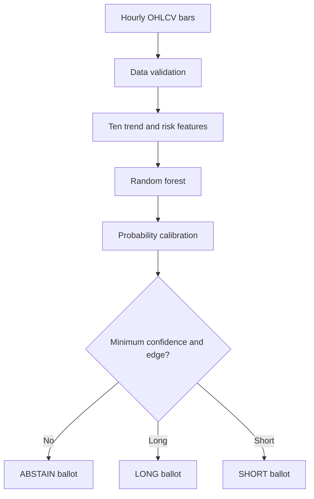
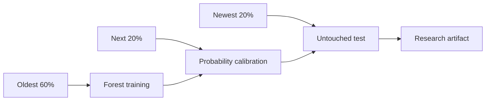

# SwingTrend-01

## A Reference Member Model for The Trading Council

`SwingTrend-01` is the first concrete TTC Member. Its purpose is educational: it shows exactly what goes inside one Member, how it is trained, what rules it follows, and what it returns to the Council.

It is a **quantitative model**, not an autonomous agent. It cannot place an order, choose a portfolio allocation, modify its own rules, or override TTC risk controls.

> Status: research reference. It must complete historical validation, shadow operation, and paper trading before any consideration of live capital.

## 1. Mandate

| Property | Value |
|---|---|
| Member ID | `TTC-SWING-TREND-01` |
| Grove | Trend |
| Purpose | Detect medium-term directional continuation |
| Initial instruments | SPY and QQQ |
| Decision interval | Completed hourly bars |
| Forecast horizon | Next 10 completed bars |
| Outputs | `LONG`, `SHORT`, or `ABSTAIN` |
| Model family | Random forest classifier with probability calibration |
| Authority | Submit a ballot only |

The model answers one question:

> Based only on information available at this completed bar, is price more likely to reach a volatility-adjusted upside barrier or downside barrier first during the next 10 bars, with sufficient probability to justify a directional ballot?

## 2. What Is Inside the Model?

The saved artifact contains the calibrated forest, exact feature order, configuration, class labels, split boundaries, test metrics, expected return by outcome, and creation timestamp. It contains no broker credentials, orders, portfolio limits, or autonomous instructions.

## 3. Model Inputs

The input is a chronological CSV with `timestamp`, `open`, `high`, `low`, `close`, and `volume`.

- Timestamps must be unique.
- Prices must be positive and internally consistent.
- Volume cannot be negative.
- Only completed bars may be supplied.

## 4. Features

| Feature | Meaning |
|---|---|
| `return_1` | Immediate direction |
| `return_5` | Short trend |
| `return_20` | Medium trend |
| `ema_gap_fast` | Close relative to 10-bar EMA |
| `ema_gap_slow` | Close relative to 30-bar EMA |
| `ema_alignment` | 10-bar EMA relative to 30-bar EMA |
| `slope_10` | Normalized 10-bar regression slope |
| `atr_pct` | 14-bar ATR relative to close |
| `range_position_20` | Close location inside the 20-bar range |
| `volume_ratio_20` | Volume relative to its 20-bar average |

All features use only current and earlier completed bars. The model intentionally starts with ten explainable measurements.

## 5. Training Labels

- `LONG`: upside barrier reached first.
- `SHORT`: downside barrier reached first.
- `NO_TRADE`: neither barrier reached before expiration.

Defaults are an upside barrier of `1.5 × ATR`, downside barrier of `1.0 × ATR`, and a 10-bar horizon. If both barriers occur inside the same OHLC bar, the row becomes `NO_TRADE` because intrabar ordering is unknowable.

## 6. Model Type

The Member uses a constrained 200-tree random forest. It captures nonlinear interactions, needs little scaling, runs quickly, and forms an understandable baseline. The entire forest represents **one Member** and submits one ballot; its internal trees are not independent TTC Members.

## 7. Chronological Training

The data is never randomly shuffled. This first model uses a simple chronological split for clarity. Production admission will require purged walk-forward validation.

## 8. Ballot Rules

1. If `NO_TRADE` is most likely, return `ABSTAIN`.
2. If the best directional probability is below 55%, return `ABSTAIN`.
3. If the best direction leads the opposite direction by less than 10 percentage points, return `ABSTAIN`.
4. Otherwise return the winning directional ballot.
5. Invalid data or model failure marks the Member unhealthy rather than producing a vote.

These are research thresholds, not optimized production settings.

## 9. Files

| File | Responsibility |
|---|---|
| `config.json` | Versioned mandate and hyperparameters |
| `requirements.txt` | Python dependencies |
| `ttc_model.py` | Validation, features, labels, training, persistence, and inference |
| `train.py` | Training entry point |
| `predict.py` | Ballot entry point |
| `tests/test_ttc_model.py` | Unit tests |

## 10. Run It

1. Install `requirements.txt`.
2. Train: `python train.py --input data.csv --output artifacts/swing-trend-01.joblib`.
3. Predict: `python predict.py --input recent-bars.csv --model artifacts/swing-trend-01.joblib`.
4. Test: `python -m unittest discover -s tests -v`.

Artifacts and datasets are ignored by Git.

## 11. Not Yet Production Complete

This reference does not yet implement purged multi-fold walk-forward validation, transaction-cost-aware model selection, Ranger eligibility, correlation analysis against other Members, drift monitoring, shadow probation, ONNX export, Python/.NET equivalence, or live integrations. Those are intentionally deferred so the anatomy of one Member stays understandable.

