# The Trading Council (TTC)

## Strategy, Decision Governance, Validation, and Operating Setup

**Document status:** Strategy specification  
**Version:** 1.0  
**Date:** August 12, 2026  
**Intended use:** Research, backtesting, paper trading, and controlled live deployment  

> The Trading Council is an ensemble trading framework in which a diverse group of specialized market voters evaluates the same trade opportunity. The system acts only when the Council demonstrates sufficient agreement, genuine diversity, calibrated edge, regime compatibility, and risk approval.

---

## 1. Executive Summary

The Trading Council (TTC) converts the idea that “the crowd can beat the genius” into a disciplined trading process. Instead of allowing one indicator, model, or trader to control a decision, TTC assembles a council of specialized voters. Each voter analyzes a different aspect of the market, expresses a directional opinion, and reports its confidence and expected trade characteristics.

The Council does not assume that a simple majority is enough. Markets frequently cause many related signals to fail together. TTC therefore distinguishes among:

- **Agreement:** How many eligible voters support a direction.
- **Independence:** Whether those voters reached the decision from genuinely different evidence.
- **Probability:** How often similar historical predictions succeeded out of sample.
- **Expected value:** Whether the probable reward exceeds the probable loss and trading costs.
- **Regime fit:** Whether the supporting voters are appropriate for the current market environment.
- **Risk capacity:** Whether the portfolio can safely accept the proposed exposure.

TTC produces one of five portfolio instructions:

1. **Enter Long**
2. **Enter Short**
3. **Hold or Maintain**
4. **Reduce or Exit**
5. **Abstain / Stay Out**

Abstention is a successful decision when no measurable edge exists. The Council is designed to avoid marginal trades, not manufacture constant activity.

---

## 2. Strategic Objectives

TTC is intended to:

- Combine multiple weak or moderate signals into a more stable decision.
- Prevent any single indicator or model from dominating the strategy.
- Detect and penalize correlated opinions that create false confidence.
- Adapt voter relevance to different market regimes.
- Trade only when estimated return remains positive after costs.
- Control exposure independently from directional prediction.
- Provide a complete audit trail explaining every decision.
- Support intraday, swing, and position trading without mixing their objectives.
- Improve through controlled retraining and validation without chasing recent performance.

TTC is not intended to:

- Guarantee profitable outcomes.
- eliminate drawdowns or tail risk.
- Use vote count as a substitute for risk management.
- Optimize for win rate at the expense of expectancy.
- Average down indefinitely without defined portfolio limits.
- Trade every market session or every available instrument.
- Allow a high-confidence forecast to bypass portfolio controls.

---

## 3. Core Principles

### 3.1 Diversity before quantity

One hundred nearly identical voters do not represent one hundred independent opinions. TTC values low correlation among voter errors more than the raw number of voters.

### 3.2 Every vote answers the same question

Voters participating in a decision must evaluate the same instrument, timestamp, direction, entry context, and holding horizon. A five-minute mean-reversion opinion cannot be counted equally with a six-week trend opinion.

### 3.3 Abstention is mandatory

Every voter may return `ABSTAIN`, and the Council itself may stay out. A forced BUY/SELL choice introduces trades where no economic edge exists.

### 3.4 Confidence must be calibrated

An 80% agreement rate does not necessarily mean an 80% probability of success. TTC maintains separate measures for agreement, historical probability, expected value, and diversity.

### 3.5 Expected value outranks win rate

A strategy can win frequently and still lose money if average losses exceed average gains. TTC approves trades based on net expectancy and drawdown characteristics, not an arbitrary win-rate target.

### 3.6 Risk has veto authority

The Risk Guardian may reject any trade regardless of Council conviction. Forecasting and risk authorization remain separate responsibilities.

### 3.7 Evidence must be time-correct

Every feature must have been knowable at the decision timestamp. Revised data, future index constituents, overlapping labels, and look-ahead information are prohibited.

### 3.8 Simplicity earns the right to complexity

TTC begins with a limited instrument universe, one horizon, and a smaller validated Council. Additional voters and markets are added only when they contribute measurable out-of-sample value.

---

## 4. TTC Operating Model

TTC is composed of six governing functions.

| Function | TTC name | Responsibility |
|---|---|---|
| Market-state classification | **The Ranger** | Identifies the current market regime and determines which voters are eligible. |
| Specialized signal generation | **The Members** | Produce long, short, or abstain opinions from distinct evidence families. |
| Vote aggregation | **The Council** | Combines eligible opinions and penalizes correlated agreement. |
| Confidence and economics | **The Conviction Engine** | Calibrates probability, calculates expected value, and assigns a conviction tier. |
| Portfolio authorization | **The Guardian** | Applies exposure, drawdown, liquidity, event, and operational limits. |
| Order implementation | **The Executor** | Converts an approved instruction into controlled orders and reconciles results. |

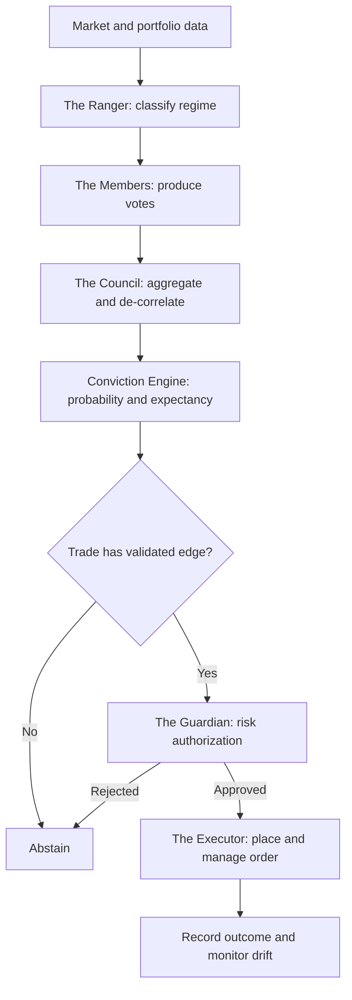

---

## 5. Council Structure

### 5.1 Recommended initial composition

The mature concept may contain approximately 100 voters. The initial production candidate should begin with 30–50 voters and expand only after the contribution of each additional voter is validated.

The following is the target 100-member structure:

| Grove | Members | Primary evidence | Typical strength | Common failure mode |
|---|---:|---|---|---|
| Trend | 12 | Price slope, moving-average structure, trend strength, breakouts | Persistent directional markets | Whipsaw in ranges |
| Momentum | 12 | Rate of change, relative strength, acceleration, oscillator structure | Directional continuation | Late entries and exhaustion |
| Mean Reversion | 10 | Statistical deviation, VWAP distance, band extremes | Balanced and range-bound markets | Fighting genuine breakouts |
| Price Structure | 10 | Swing levels, gaps, pivots, support/resistance | Defined invalidation and asymmetric entries | Subjective or crowded levels |
| Volatility | 10 | Realized volatility, range expansion, compression | Transition and breakout detection | Directional ambiguity |
| Volume and Liquidity | 10 | Relative volume, participation, spread, turnover | Confirms or rejects price movement | Venue and data limitations |
| Breadth | 8 | Participation, sector confirmation, index internals | Index and sector confirmation | Divergence can persist |
| Intermarket | 8 | Volatility index, rates, dollar, bonds, correlated assets | Macro confirmation and risk context | Changing relationships |
| Regime Specialists | 12 | Models dedicated to bull, bear, range, crisis, or recovery states | Environment-specific behavior | Regime classification error |
| Cross-Sectional | 8 | Instrument performance versus benchmark, sector, and peers | Relative opportunity selection | Sector concentration and crowding |
| **Total** | **100** |  |  |  |

### 5.2 Voter diversity requirements

Two voters are not considered meaningfully distinct merely because they use different parameter values. Diversity should come from several dimensions:

- Different signal families.
- Different feature subsets.
- Different historical samples.
- Different market regimes.
- Different lookback lengths.
- Different decision boundaries.
- Different training seeds and bootstrap samples.
- Different sensitivity to volatility and liquidity.
- Different error patterns during out-of-sample testing.

Each candidate voter must demonstrate at least one of the following:

- Incremental improvement in net out-of-sample expectancy.
- Reduced portfolio drawdown.
- Improved performance in an underrepresented regime.
- Lower error correlation with existing members.
- Improved probability calibration.
- Useful abstention behavior that filters weak opportunities.

### 5.3 Voting eligibility

A Council member may vote only when:

- Its required data is complete and current.
- The instrument falls within its validated universe.
- The current regime is within its approved operating domain.
- Its model version is active and has passed health checks.
- Its recent performance has not triggered suspension rules.
- The decision horizon matches the Council session.

An ineligible voter does not count as an abstention. It is removed from the denominator and recorded separately.

---

## 6. Separate Councils by Trading Horizon

TTC must operate distinct councils because different horizons represent different economic questions.

| Council | Illustrative horizon | Typical data | Intended application |
|---|---|---|---|
| Intraday Council | 30 minutes to one session | Minute and hourly bars, intraday volume, VWAP, market internals | Tactical ETF or futures trades |
| Swing Council | 2–10 sessions | Hourly and daily bars, breadth, sector and macro context | Multi-day ETF or equity positions |
| Position Council | 2–12 weeks | Daily and weekly bars, macro regime, long-term relative strength | Strategic allocation and position trades |

A higher-timeframe Council can filter or reduce the size of a lower-timeframe trade, but its votes are not mixed directly into the lower-timeframe denominator.

Example:

- Intraday Council: 79% effective long consensus.
- Swing Council: 66% effective short consensus.
- Result: the intraday long may be rejected or approved at reduced size because the higher-timeframe context is adverse.

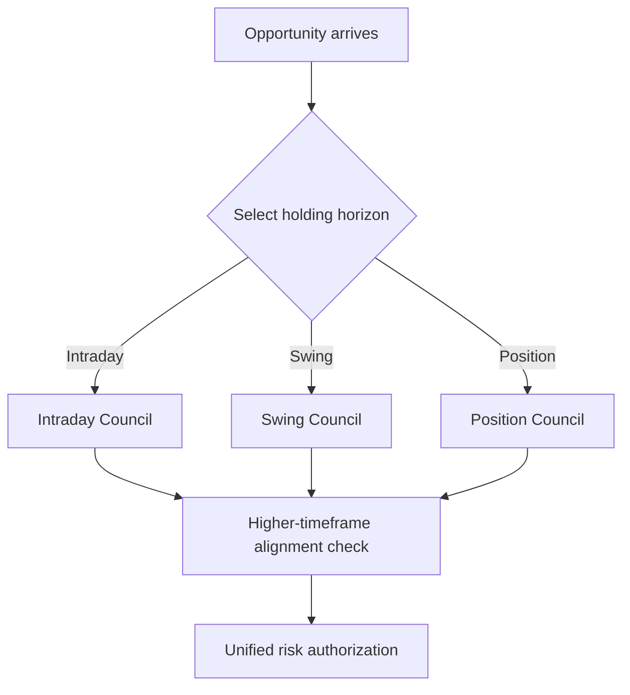

---

## 7. Defining the Trade Question

Before a vote begins, TTC creates a standardized decision mandate. It specifies:

- Instrument.
- Decision timestamp.
- Intended entry window.
- Holding horizon.
- Long and short profit objectives.
- Adverse-move boundary.
- Maximum holding duration.
- Estimated commissions, spread, slippage, and financing.
- Benchmark or alternative use of capital.

The preferred outcome definition uses three classes:

- **LONG:** The upward objective is reached before the downward boundary within the allowed horizon, after costs.
- **SHORT:** The downward objective is reached before the upward boundary within the allowed horizon, after costs.
- **NO TRADE:** Neither side produces sufficient net movement, or the evidence is indeterminate.

Profit and adverse boundaries should adapt to instrument volatility rather than use identical percentage thresholds across all markets.

---

## 8. The Ranger: Market Regime Classification

The Ranger classifies the environment before Members vote. At minimum, it evaluates four dimensions.

### 8.1 Directional regime

- Bull trend
- Bear trend
- Range or balance
- Transition or uncertain

### 8.2 Volatility regime

- Compressed
- Normal
- Elevated
- Crisis or disorderly

### 8.3 Liquidity regime

- Normal and liquid
- Thin or deteriorating
- Dislocated

### 8.4 Macro risk regime

- Risk-on
- Neutral
- Risk-off
- Scheduled-event uncertainty

The Ranger should return a probability distribution rather than pretend that every regime boundary is certain. When regime uncertainty is high, TTC reduces size, raises the required edge, or abstains.

Regime classification affects:

- Which Members may participate.
- Each Member’s maximum influence.
- The minimum consensus threshold.
- Required expected value.
- Permitted position size.
- Holding-period assumptions.

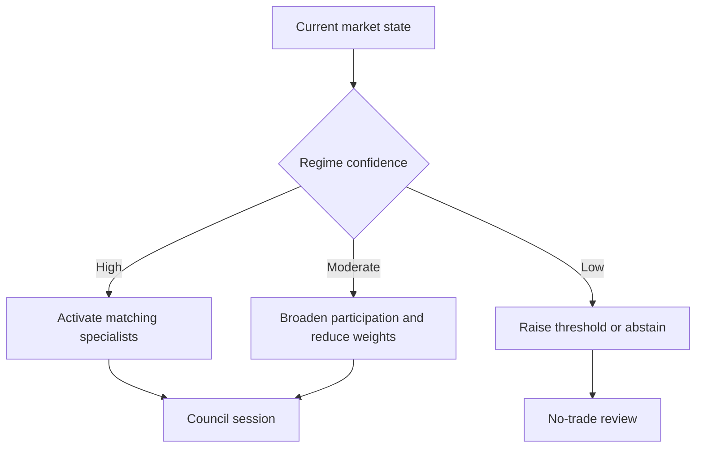

---

## 9. Member Opinion Format

Every eligible Member submits a standardized ballot containing:

| Field | Purpose |
|---|---|
| Direction | Long, short, or abstain |
| Raw probability | Member’s estimated probability before calibration |
| Expected favorable movement | Anticipated reward over the stated horizon |
| Expected adverse movement | Anticipated risk over the stated horizon |
| Maximum holding period | Time after which the forecast expires |
| Regime compatibility | Degree of fit with the current environment |
| Data quality status | Completeness and freshness of required inputs |
| Reason codes | Primary evidence supporting the opinion |
| Model identity | Version and approved operating scope |

Votes expire. TTC must not execute an old decision after market conditions materially change.

---

## 10. Consensus Formation

### 10.1 Raw vote shares

The Council first calculates long, short, and abstain shares among eligible Members. Raw agreement is useful for transparency but is not sufficient for authorization.

### 10.2 Member weights

Member influence may reflect:

- Long-term out-of-sample reliability.
- Current regime suitability.
- Probability calibration quality.
- Stability across validation periods.
- Data quality and freshness.
- Correlation with other supporting voters.

Weights must be bounded so one Member cannot become a dictator. Changes should occur gradually on a governed schedule, not immediately after every win or loss.

### 10.3 Correlation penalty

The Council measures whether supporting Members commonly make the same errors. A cluster of nearly identical trend voters should contribute less incremental confidence than agreement between trend, breadth, volume, and intermarket specialists.

TTC records:

- Raw supporting voter count.
- Effective independent voter count.
- Average pairwise error correlation.
- Concentration by signal grove.
- Percentage of conviction contributed by the largest grove.

No single grove should provide enough influence to independently authorize a trade.

### 10.4 Breadth-of-evidence rule

A trade requires support from multiple evidence families. An illustrative initial standard is:

- At least four participating groves.
- At least three groves aligned with the winning direction.
- No more than 40% of effective conviction from one grove.
- No critical opposing signal from liquidity or risk-sensitive Members.

These thresholds must be validated rather than assumed permanent.

---

## 11. The Conviction Engine

The Conviction Engine converts Council agreement into an actionable assessment.

### 11.1 Required components

1. **Effective consensus:** Agreement adjusted for voter weights and dependence.
2. **Calibrated success probability:** Observed out-of-sample success rate for comparable predictions.
3. **Expected reward:** Estimated favorable outcome if correct.
4. **Expected loss:** Estimated adverse outcome if wrong.
5. **Trading costs:** Commissions, bid-ask spread, slippage, financing, and market impact.
6. **Regime fit:** Compatibility between current conditions and the supporting Members.
7. **Uncertainty adjustment:** Penalty for sparse history, drift, missing data, or unusual conditions.

### 11.2 Expected-value requirement

The economic decision is:

\[
\text{Net Expectancy} = P(\text{win}) \times \text{Average Win}
- P(\text{loss}) \times \text{Average Loss}
- \text{Trading Costs}
\]

A trade is rejected whenever net expectancy is not meaningfully positive, regardless of the number of supporting votes.

### 11.3 Conviction tiers

The following thresholds are starting hypotheses for research, not guaranteed production settings.

| Tier | Illustrative conditions | Permitted response |
|---|---|---|
| No Edge | Effective consensus below 60% or expectancy non-positive | Abstain |
| Watch | 60–69% consensus with marginal positive expectancy | Record and monitor; no capital |
| Qualified | 70–79% consensus, calibrated edge, sufficient diversity | Reduced-size position |
| Strong | 80–89% consensus, strong net expectancy, good regime fit | Standard position |
| Exceptional | 90%+ consensus, high diversity, strong calibration, no risk conflicts | Moderately increased size within hard limits |

Exceptional conviction should be rare. Frequent 90% readings are evidence that Members may be too correlated or that confidence is poorly calibrated.

### 11.4 Confidence degradation

Conviction is reduced when:

- The market regime is uncertain.
- Supporting votes come from too few groves.
- Member errors have become more correlated.
- Live calibration has deteriorated.
- Volatility exceeds the training domain.
- Spreads or slippage rise.
- A major scheduled event falls inside the holding window.
- The signal has aged before execution.

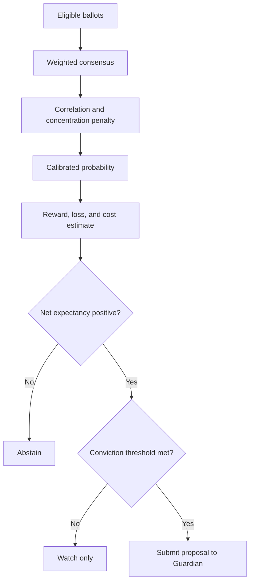

---

## 12. The Guardian: Risk and Portfolio Authorization

The Guardian is independent from the predictive Council and possesses unconditional veto authority.

### 12.1 Trade-level controls

- Maximum capital per position.
- Maximum loss budget per trade.
- Minimum liquidity and maximum spread.
- Maximum expected slippage.
- Defined invalidation and time-stop conditions.
- Instrument-specific leverage restrictions.
- Restrictions around earnings, economic releases, and market closures.

### 12.2 Portfolio-level controls

- Maximum gross and net exposure.
- Maximum portfolio heat.
- Maximum exposure to one asset, sector, factor, or theme.
- Correlation-aware exposure limits.
- Daily, weekly, and rolling drawdown limits.
- Limits on overnight and weekend risk.
- Cash and margin reserve requirements.

### 12.3 Operational controls

- Market-data freshness.
- Broker connectivity and order-state consistency.
- Duplicate-order prevention.
- Clock synchronization.
- Position reconciliation.
- Emergency disable switch.
- Manual override with full audit record.

### 12.4 Drawdown response

| Condition | Guardian response |
|---|---|
| Normal operating range | Standard risk limits |
| Mild drawdown | Reduce new-position risk and raise entry threshold |
| Significant drawdown | Suspend lower-conviction tiers and investigate drift |
| Hard drawdown limit | Stop new entries; allow only risk-reducing actions |
| Operational inconsistency | Freeze automated orders and reconcile state |

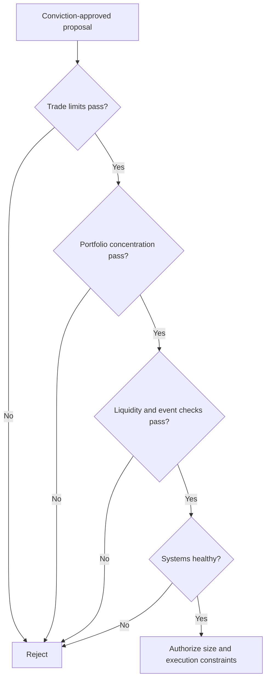

---

## 13. Position Sizing

Position size is based on risk capacity, volatility, and calibrated conviction—not raw vote count.

A practical conceptual relationship is:

\[
\text{Position Size} =
\text{Base Risk Budget}
\times \text{Conviction Multiplier}
\times \text{Volatility Adjustment}
\times \text{Portfolio Capacity Adjustment}
\]

Illustrative conviction multipliers:

| Conviction tier | Initial multiplier |
|---|---:|
| Qualified | 0.50× |
| Strong | 1.00× |
| Exceptional | 1.25× |

The Exceptional tier must never bypass instrument or portfolio caps. TTC should avoid full Kelly sizing because small probability-estimation errors can create excessive leverage. Conservative fixed-fractional or volatility-targeted sizing is preferred.

---

## 14. Entry Rules

An entry may occur only when all required conditions are true:

1. A formal decision mandate exists.
2. Data quality and freshness checks pass.
3. The Ranger identifies an approved or tolerable regime.
4. The minimum number of eligible Members participates.
5. Effective consensus meets the selected conviction tier.
6. Breadth-of-evidence and diversity requirements pass.
7. Calibrated probability meets the minimum standard.
8. Net expectancy remains positive after all estimated costs.
9. The opportunity has not expired.
10. The Guardian authorizes exposure.
11. Execution conditions remain within approved spread and slippage limits.

TTC may require a market trigger after approval—for example, level confirmation, breakout acceptance, reversal confirmation, or liquidity restoration. The vote establishes intent; the trigger controls timing.

---

## 15. Position Management and Exit Rules

TTC separates entry forecasting from position management. Once a position exists, it is evaluated by a new mandate that includes the current position, realized path, remaining horizon, and updated market state.

### 15.1 Exit categories

- **Objective reached:** Planned favorable outcome occurs.
- **Invalidation:** Market behavior contradicts the trade thesis.
- **Time stop:** The anticipated move fails to occur within the approved horizon.
- **Council reversal:** A sufficiently strong opposing decision is approved.
- **Conviction decay:** Updated expectancy becomes non-positive.
- **Risk reduction:** Portfolio limits require smaller exposure.
- **Operational exit:** Data or brokerage conditions make continued automated management unsafe.

### 15.2 Re-voting frequency

Re-voting should match the Council horizon and should not react to every insignificant tick. Suggested principles:

- Intraday: evaluate on completed decision bars and material risk events.
- Swing: evaluate at scheduled intraday checkpoints or daily close.
- Position: evaluate daily or weekly unless a risk trigger occurs.

### 15.3 Adding to positions

TTC may add only when:

- The new decision independently satisfies entry requirements.
- Total risk remains within the original or revised portfolio budget.
- The addition does not merely conceal an invalidated thesis.
- Liquidity and correlation limits still pass.
- The revised expected value is positive for the entire position.

There is no unrestricted averaging down. Every addition is a new risk decision.

### 15.4 Profit management

Partial profit-taking may be used when it improves the strategy’s drawdown and expectancy profile. The method must be defined before deployment and tested consistently. Possible approaches include:

- Fixed objective with full exit.
- Partial exit at the first objective and trailing remainder.
- Volatility-adjusted trailing protection.
- Council-driven reduction when conviction weakens.

The research process should select one primary management policy per Council horizon to avoid discretionary backtest tuning.

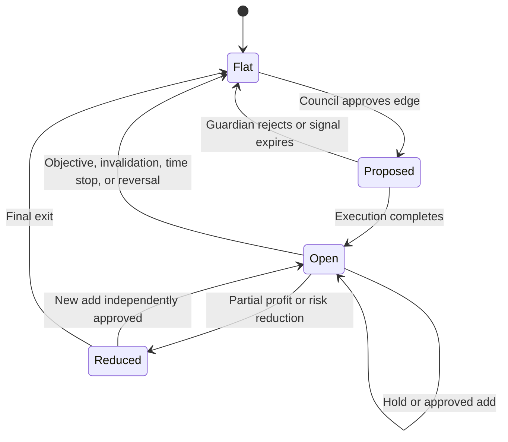

---

## 16. Instrument Selection

The first TTC deployment should use highly liquid instruments with reliable historical and real-time data. A sensible initial universe is:

- SPY
- QQQ
- IWM
- XLK
- XLF

The first production trial should use only one or two instruments, preferably SPY and QQQ. Expansion requires instrument-specific validation because the same signal may behave differently across products.

Eligibility standards should cover:

- Minimum average traded value.
- Maximum typical bid-ask spread.
- Sufficient history across multiple regimes.
- Stable execution access.
- Reliable corporate-action handling where applicable.
- Known trading hours and event calendar.

---

## 17. Data and Feature Setup

### 17.1 Required data categories

- Adjusted and unadjusted price history.
- Intraday and daily volume.
- Bid-ask or spread estimates where available.
- Volatility measures.
- Market breadth and sector context.
- Intermarket inputs such as volatility, rates, dollar, and bonds.
- Trading calendar and scheduled event data.
- Portfolio positions, cash, margin, and realized exposure.
- Order and execution history.

### 17.2 Data quality controls

- Missing-bar detection.
- Duplicate and out-of-order record detection.
- Corporate-action reconciliation.
- Time-zone normalization.
- Session and holiday validation.
- Stale-data alarms.
- Point-in-time data enforcement.
- Source-version and correction tracking.

### 17.3 Feature governance

Every feature requires:

- Definition and economic rationale.
- Required inputs.
- Earliest availability timestamp.
- Supported instruments and horizons.
- Missing-value behavior.
- Expected range and drift thresholds.
- Version history.

Feature selection must prioritize robustness and independence rather than accumulating every available indicator.

---

## 18. Training and Validation Methodology

### 18.1 Chronological validation

Market observations must remain ordered in time. Random shuffling is inappropriate because it allows future market relationships to influence past decisions.

### 18.2 Walk-forward process

Each evaluation cycle should:

1. Train using only the available historical window.
2. Calibrate using a later, separate period.
3. Test on the next untouched interval.
4. Advance the windows through time.
5. Combine results across multiple market regimes.

### 18.3 Purging and embargo

When labels overlap in time, training observations that share information with the validation interval must be removed. A protective time gap should separate training and validation where necessary.

### 18.4 Final holdout

A final time period must remain untouched until the full strategy, thresholds, and management rules are frozen. It cannot be reused repeatedly for optimization.

### 18.5 Cost realism

Every backtest must include:

- Commissions and regulatory fees.
- Bid-ask spread.
- Slippage.
- Market impact appropriate to order size.
- Financing or borrow cost where relevant.
- Delayed or missed fills.
- Execution latency.

### 18.6 Benchmark comparisons

TTC should be compared with:

- Buy and hold.
- Cash or the relevant risk-free alternative.
- A simple trend baseline.
- A simple mean-reversion baseline.
- An equal-weight Council without confidence or correlation adjustments.

The advanced Council is justified only if it improves meaningful out-of-sample results after complexity and costs.

---

## 19. Evaluation Scorecard

No single metric determines approval.

### 19.1 Economic performance

- Net return.
- Net expectancy per trade.
- Profit factor.
- Average win and average loss.
- Payoff ratio.
- Turnover and estimated capacity.

### 19.2 Risk performance

- Maximum drawdown.
- Drawdown duration.
- Volatility.
- Sharpe and Sortino ratios.
- Tail losses.
- Worst day, week, and trade.

### 19.3 Predictive quality

- Precision among executed trades.
- Calibrated probability accuracy.
- Brier score or equivalent calibration measure.
- Abstention effectiveness.
- Performance by conviction tier.
- Performance by regime and instrument.

### 19.4 Stability

- Training-to-validation decay.
- Variation across walk-forward windows.
- Sensitivity to reasonable parameter changes.
- Voter error correlation.
- Dependence on the best few trades.
- Performance before and after higher cost assumptions.

### 19.5 Operational quality

- Data interruptions.
- Rejected and duplicate orders.
- Fill quality.
- State reconciliation failures.
- Decision latency.
- Time spent outside validated operating domains.

---

## 20. Member Admission, Suspension, and Retirement

### 20.1 Admission

A new Member must demonstrate:

- A clear economic rationale or distinct empirical role.
- Positive out-of-sample contribution after costs.
- Acceptable calibration.
- Stability across multiple periods.
- Incremental diversity relative to the existing Council.
- No prohibited information leakage.

### 20.2 Probation

New Members enter shadow status. Their votes are recorded but do not influence capital until sufficient forward observations are collected.

### 20.3 Suspension

A Member is suspended when:

- Required data becomes unreliable.
- Calibration exceeds defined error limits.
- Performance falls outside its validated range.
- Error correlation materially increases.
- The active market falls outside the Member’s approved domain.
- Operational health checks fail.

### 20.4 Retirement

A Member is retired when its contribution remains redundant or harmful across a governed review period. Retirement is based on portfolio contribution, not a short losing streak.

---

## 21. Drift and Health Monitoring

TTC monitors three categories of drift:

### 21.1 Data drift

The distribution of inputs changes relative to the training domain.

### 21.2 Prediction drift

Vote frequency, abstention rate, conviction distribution, or grove concentration changes materially.

### 21.3 Performance drift

Observed outcomes diverge from calibrated expectations.

Monitoring should compare expected and realized results by:

- Instrument.
- Council horizon.
- Regime.
- Conviction tier.
- Grove and individual Member.
- Long and short direction.

Drift triggers should reduce influence or suspend affected Members before automatic retraining. Retraining is not an automatic cure for structural change.

---

## 22. Decision Audit Record

Every Council session should preserve:

- Instrument, timestamp, and horizon.
- Market regime and regime confidence.
- Eligible, ineligible, and abstaining Member counts.
- Individual ballots and reason codes.
- Raw and effective consensus.
- Effective independent voter count.
- Grove concentration and error correlation.
- Calibrated probability.
- Estimated reward, loss, costs, and net expectancy.
- Conviction tier.
- Guardian checks and rejection reasons.
- Approved position size and execution constraints.
- Orders, fills, slippage, and final position.
- Exit reason and realized result.
- Model, feature, data, and policy versions.

The audit record must allow a reviewer to reconstruct exactly why TTC acted or abstained.

---

## 23. Application Scenarios

### 23.1 Strong diversified long decision

- Trend, momentum, breadth, volume, and intermarket groves support long.
- Mean-reversion Members mostly abstain rather than oppose.
- Effective consensus is 83% after correlation penalties.
- Calibrated probability is materially lower than raw consensus but remains acceptable.
- Expected reward exceeds expected loss and costs.
- The Ranger identifies a bull trend with normal volatility.
- The Guardian approves standard risk.

**Action:** Enter a standard-sized long position using the approved execution conditions.

### 23.2 False high confidence

- Ninety raw votes support long.
- Most support comes from closely related trend and momentum variants.
- Breadth and volume do not confirm.
- Effective independent voter count is low.
- Correlation adjustment reduces effective consensus below the Qualified tier.

**Action:** Abstain. Raw unanimity is not accepted as genuine conviction.

### 23.3 Positive forecast rejected by risk

- The Council reaches Strong long conviction.
- The portfolio already holds correlated technology and index exposure.
- Adding the trade would breach factor concentration limits.

**Action:** Reject or reduce the proposal. The forecast may be correct, but the portfolio cannot safely accept the risk.

### 23.4 Council uncertainty

- Long support is 55% and short support is 45%.
- Expected value is close to zero after spread and slippage.
- Regime classification is uncertain.

**Action:** Stay out. TTC does not force a decision from a divided Council.

### 23.5 Existing position loses conviction

- An open long began with Strong conviction.
- Trend remains positive, but breadth and liquidity deteriorate.
- Updated expectancy becomes marginal while the objective remains unreached.

**Action:** Reduce or exit according to the prevalidated management policy rather than waiting for the original forecast to recover.

---

## 24. Deployment Stages

### Stage 0 — Strategy charter

- Select one Council horizon.
- Define instruments and trading hours.
- Freeze outcome labels and transaction-cost assumptions.
- Establish risk limits and approval criteria.
- Define all required audit fields.

### Stage 1 — Research Council

- Use SPY and QQQ initially.
- Begin with 30–50 controlled-diversity Members.
- Establish simple equal-weight consensus as a baseline.
- Add correlation and regime adjustments independently.
- Compare each layer against the simpler baseline.

### Stage 2 — Historical validation

- Complete chronological walk-forward testing.
- Validate across bull, bear, range, high-volatility, and recovery periods.
- Stress costs and delayed execution.
- Freeze the strategy before opening the final holdout.
- Produce a formal validation report and go/no-go decision.

### Stage 3 — Shadow operation

- Run in real time without sending orders.
- Record every Council session and hypothetical fill.
- Compare expected probability with realized outcomes.
- Validate data freshness, latency, drift detection, and reconciliation.

### Stage 4 — Paper trading

- Connect the complete decision and execution process to a simulated account.
- Test partial fills, rejections, disconnects, and restarts.
- Enforce the same risk limits intended for production.
- Require stable operations before considering real capital.

### Stage 5 — Controlled live pilot

- Trade one highly liquid instrument.
- Use minimal capital and reduced risk multipliers.
- Permit only Qualified and Strong tiers initially.
- Require human approval until execution behavior is proven.
- Review every live decision and fill.

### Stage 6 — Scaled production

- Increase capital gradually based on live evidence.
- Add instruments one at a time.
- Introduce Exceptional-tier sizing only after calibration is proven live.
- Maintain rollback, model suspension, and emergency-stop procedures.

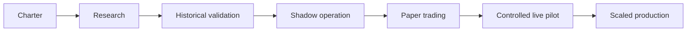

---

## 25. Initial Strategy Setup Decisions

The following decisions should be explicitly approved before research begins:

| Category | Recommended initial decision |
|---|---|
| Primary Council | Swing Council |
| Initial instruments | SPY and QQQ |
| Decision frequency | Hourly evaluation with daily context |
| Holding horizon | 2–10 trading sessions |
| Initial Members | 30–50 |
| Mature target | Up to 100, subject to incremental value |
| Outcomes | Long, short, no trade |
| Minimum actionable tier | Qualified |
| Initial live tiers | Qualified and Strong only |
| Position sizing | Conservative volatility-adjusted fixed risk |
| Rebalancing of voter weights | Slow, governed schedule |
| Initial execution | Shadow, then paper trading |
| First live instrument | SPY |
| Short exposure | Disabled initially or implemented only through predefined liquid instruments |

### Why begin with the Swing Council

The Swing Council offers a useful balance:

- More observations than long-term position trading.
- Lower execution sensitivity than high-frequency intraday trading.
- Enough time for trend, breadth, volatility, and intermarket evidence to contribute.
- Easier auditability and operational control during the initial rollout.

---

## 26. Governance and Change Control

TTC strategy changes require versioning and documented approval. Governed items include:

- Member roster.
- Feature definitions.
- Regime rules.
- Consensus and conviction thresholds.
- Position-sizing multipliers.
- Entry and exit policies.
- Cost assumptions.
- Instrument universe.
- Risk limits.
- Retraining schedule.

No material rule should be changed because of one recent loss or missed opportunity. Every change requires:

1. A stated hypothesis.
2. A predefined evaluation method.
3. Out-of-sample evidence.
4. Comparison with the current production version.
5. Approval and version release notes.
6. A rollback path.

---

## 27. Failure Modes and Safeguards

| Failure mode | Consequence | TTC safeguard |
|---|---|---|
| Correlated voters | False confidence | Error-correlation penalty and grove concentration limits |
| Look-ahead leakage | Unrealistic backtest | Point-in-time data and chronological validation |
| Overfitting thresholds | Performance collapse | Final holdout, walk-forward testing, and change governance |
| Regime transition | Specialists become unreliable | Ranger uncertainty penalty and reduced exposure |
| Excessive turnover | Edge consumed by costs | Net-expectancy gate and realistic execution modeling |
| Confidence miscalibration | Oversized positions | Separate calibration layer and conservative sizing |
| One grove dominates | Hidden single-strategy exposure | Breadth-of-evidence requirements |
| Weight chasing | Recent winners receive excessive influence | Bounded, slow weight changes |
| Data outage | Invalid decisions | Freshness checks and automated abstention |
| Broker-state mismatch | Duplicate or incorrect exposure | Reconciliation and execution freeze |
| Unrestricted averaging down | Compounding losses | Every add requires new authorization and total-risk limits |
| Human override without record | Governance failure | Mandatory reason and audit trail |

---

## 28. Go-Live Acceptance Criteria

TTC should not trade real capital until:

- The strategy charter and risk policy are approved.
- Historical data has passed quality controls.
- Walk-forward and final-holdout results meet predefined criteria.
- Net performance remains acceptable under stressed costs.
- Results are not dependent on one regime, one instrument, or a few trades.
- Conviction tiers demonstrate reasonable calibration.
- Shadow and paper-trading periods meet operational stability requirements.
- Position and order reconciliation is reliable.
- Emergency disable and recovery procedures are tested.
- A human can reconstruct every decision from the audit record.
- Live capital and loss limits are explicitly authorized.

---

## 29. Recommended Research Questions

The initial TTC research program should answer:

1. Does the Council outperform its best individual Member out of sample?
2. Does correlation-adjusted consensus outperform simple majority voting?
3. Which groves contribute incremental value in each regime?
4. Does abstention improve expectancy and reduce drawdown?
5. How many effective independent voters exist despite the nominal roster size?
6. Are predicted probabilities calibrated by regime and conviction tier?
7. Does the Ranger improve results after accounting for additional complexity?
8. Which holding horizon produces the most stable net edge?
9. How sensitive is performance to realistic cost and latency assumptions?
10. Does confidence-based sizing improve risk-adjusted returns over fixed sizing?
11. When does higher-timeframe disagreement justify rejection versus reduced size?
12. What live-performance degradation should trigger suspension?

---

## 30. What the TTC Model Is

The term **TTC model** refers to the complete decision system, not one machine-learning artifact. TTC is a governed ensemble made of several model types and deterministic control layers.

| Layer | Form | Primary purpose |
|---|---|---|
| Market data model | Point-in-time data contract | Represents the market exactly as it was knowable at the decision time |
| Feature pipeline | Deterministic calculations | Converts raw market data into stable measurements |
| Member models | Specialized quantitative classifiers or estimators | Produce independent long, short, or abstain ballots |
| Ranger model | Regime classifier | Identifies the market environment and voter eligibility |
| Council model | Weighted ensemble | Aggregates ballots and penalizes dependent opinions |
| Calibration model | Probability mapping | Converts model scores into observed success probabilities |
| Conviction model | Economic decision function | Determines whether the opportunity has sufficient net expectancy |
| Guardian policy | Deterministic rules engine | Enforces portfolio and operational risk limits |
| Execution policy | Deterministic state machine | Implements approved trades within price and order constraints |

The recommended architecture deliberately separates prediction from authorization. Machine-learning models may estimate what is likely to happen; deterministic policies decide whether capital may be committed.

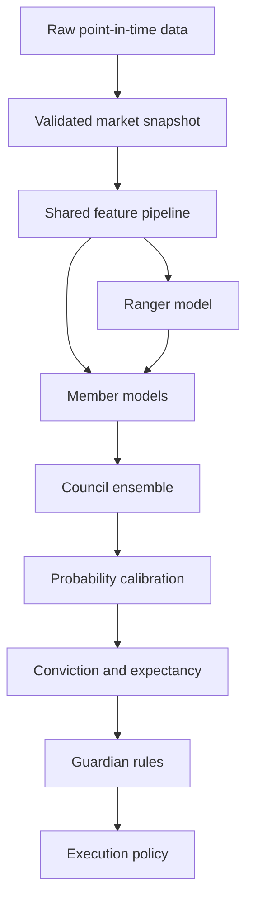

### 30.1 What a Member is

A Member is a logical quantitative voting unit with one narrow trading mandate. It is best understood as a specialized bot backed by a statistical or machine-learning model. It is not an autonomous conversational agent.

A Member may internally use:

- A single decision tree.
- A small random forest.
- A gradient-boosted tree model.
- A logistic regression model.
- A rules-based statistical model.
- A calibrated combination of related models.

One Member does not necessarily equal one literal tree. A Member represents one governed trading thesis. For example, `SwingTrend-07` might contain a small forest trained only on medium-term trend evidence. Its internal trees collectively produce one Member ballot.

This prevents TTC from falsely treating hundreds of highly related trees from one algorithm as hundreds of independent market opinions.

### 30.2 What a Member is not

A Member does not:

- Place orders.
- Decide portfolio exposure.
- Change its own mandate.
- Communicate with other Members before voting.
- Search the internet during normal inference.
- Create new indicators during a Council session.
- Override the Ranger, Guardian, or Executor.
- Receive credit merely for agreeing with the majority.

The Member evaluates its assigned evidence and submits a ballot. Its authority ends there.

---

## 31. What the Model Is Comprised Of

### 31.1 Raw market inputs

The first Swing Council should use a controlled set of inputs:

- Adjusted and unadjusted OHLCV bars.
- Intraday and daily returns.
- Bid-ask spread or a defensible spread estimate.
- Realized and implied volatility where licensed and available.
- Broad-market and sector returns.
- Market breadth.
- Treasury yields and bond-market context.
- U.S. dollar and volatility-index context.
- Trading calendar and scheduled-event flags.
- Current portfolio exposure and available risk budget.

Raw data is never sent directly to every model independently. TTC first constructs one immutable market snapshot so that all Members evaluate the same timestamp and information set.

### 31.2 Shared features

The feature pipeline derives measurements such as:

| Feature family | Examples | Intended information |
|---|---|---|
| Trend | Price slopes, moving-average relationships, directional persistence | Whether price is moving directionally |
| Momentum | Rate of change, acceleration, relative strength | Whether movement is strengthening or weakening |
| Mean reversion | Standardized deviation, VWAP distance, range location | Whether price is unusually extended |
| Structure | Swing levels, breakout distance, gaps, pivot relationships | Where price sits relative to meaningful levels |
| Volatility | Realized range, volatility percentile, compression and expansion | Expected movement and regime instability |
| Volume | Relative volume, volume trend, price-volume confirmation | Participation behind the price move |
| Breadth | Participation across constituents and sectors | Whether index movement is broadly supported |
| Intermarket | Rates, bonds, dollar, volatility, correlated indexes | Whether related markets confirm the thesis |
| Liquidity | Spread, turnover, bar completeness | Whether the opportunity is executable |

Features are versioned. A Member is approved against a specific feature definition and cannot silently consume a changed calculation.

### 31.3 Specialized Member models

Members are organized into groves. Members within a grove share an economic theme but should differ in training samples, feature subsets, decision boundaries, or regime specialization.

For the initial 40-Member Swing Council, the recommended allocation is:

| Grove | Initial Members | Illustrative model role |
|---|---:|---|
| Trend | 5 | Continuation across short, medium, and long lookbacks |
| Momentum | 5 | Directional acceleration and relative strength |
| Mean Reversion | 4 | Statistical extension and return toward balance |
| Price Structure | 4 | Breakout, rejection, gap, and level behavior |
| Volatility | 4 | Compression, expansion, and volatility transition |
| Volume and Liquidity | 4 | Participation and execution-quality confirmation |
| Breadth | 3 | Index and sector participation |
| Intermarket | 3 | Rates, volatility, dollar, bonds, and index confirmation |
| Regime Specialists | 5 | Bull, bear, range, stressed, and recovery environments |
| Cross-Sectional | 3 | Instrument strength versus benchmark and sector |
| **Total** | **40** |  |

The mature Council may grow toward 100 Members, but only when new Members add independent out-of-sample value.

### 31.4 Ranger regime model

The Ranger estimates the probability of the current market being in each approved state. It uses market-level evidence rather than the trade outcome being predicted by individual Members.

Its output may resemble:

| Regime | Probability |
|---|---:|
| Bull trend, normal volatility | 58% |
| Range, normal volatility | 22% |
| Bull trend, elevated volatility | 12% |
| Transition or uncertain | 8% |

The Ranger does not need to force one absolute label. Probability-weighted eligibility prevents abrupt behavior when the market sits near a regime boundary.

### 31.5 Council aggregation model

The Council receives one ballot from each eligible Member and calculates:

- Raw long, short, and abstain shares.
- Reliability-weighted agreement.
- Regime-adjusted agreement.
- Grove concentration.
- Pairwise error dependence.
- Effective independent Member count.
- Evidence-family breadth.

The Council’s main purpose is not to maximize agreement. Its purpose is to determine whether agreement represents several independent sources of evidence.

### 31.6 Calibration and Conviction models

Calibration answers:

> When TTC previously generated predictions like this, how often did the defined favorable outcome actually occur?

Conviction then combines that probability with reward, loss, costs, uncertainty, and regime compatibility. A high vote share with poor calibration or negative expectancy is rejected.

### 31.7 Guardian and Executor

The Guardian and Executor are not learned trading models in the initial design. They are deterministic policies because their behavior must remain predictable, testable, and auditable.

The Guardian converts an approved opportunity into a maximum allowable risk allocation. The Executor converts that allocation into broker instructions while managing order state, fills, cancellations, and reconciliation.

---

## 32. How TTC Models Are Built

### 32.1 Define the mandate first

Model development begins with an economic question, not an algorithm. Every Member mandate specifies:

- Instrument universe.
- Holding horizon.
- Eligible regimes.
- Permitted feature families.
- Target outcome.
- Profit and adverse barriers.
- Time limit.
- Trading-cost assumption.
- Conditions that require abstention.

Example mandate:

> Determine whether SPY has positive long or short expectancy over the next two to ten sessions using medium-term trend evidence during directional, normally liquid regimes.

### 32.2 Create time-bound labels

Historical observations are labeled according to which economically meaningful outcome occurred first:

- Upward barrier reached: candidate LONG outcome.
- Downward barrier reached: candidate SHORT outcome.
- Neither reached before expiration: NO TRADE outcome.

Barriers are volatility-aware and include estimated costs. This avoids training the model to predict economically meaningless next-bar color.

### 32.3 Build the point-in-time dataset

For each historical decision timestamp, TTC reconstructs only information that was available at that time. The dataset includes:

- Immutable market snapshot.
- Approved feature version.
- Ranger-compatible regime information.
- Time-bound outcome label.
- Instrument and session metadata.

Observations with missing, corrected, or unverifiable inputs are excluded or explicitly marked according to the data policy.

### 32.4 Train diverse candidates

Several candidate Members are trained for each mandate using controlled differences:

- Different feature subsets.
- Different bootstrap samples.
- Different training windows.
- Different tree depth and regularization.
- Different regime focus.
- Different probability thresholds.
- Different random seeds.

Diversity is intentional, but randomness alone does not earn admission. Every candidate must demonstrate a stable role.

### 32.5 Validate chronologically

Candidate Members are evaluated through walk-forward validation with purging and embargo where labels overlap. Selection considers:

- Net expectancy after costs.
- Maximum drawdown contribution.
- Calibration.
- Stability across periods and regimes.
- Error correlation with admitted Members.
- Value of abstention.
- Sensitivity to moderate parameter changes.

The Member with the highest historical return is not automatically selected. A slightly weaker Member may be more valuable if its errors are independent and it protects the Council in a difficult regime.

### 32.6 Calibrate probabilities

Raw model scores are calibrated using data not used to fit the underlying Member. Calibration maps model confidence to an observed out-of-sample frequency.

For example, if predictions assigned approximately 70% confidence succeed only 58% of the time, TTC must use the calibrated probability near 58%, not the raw 70% score.

### 32.7 Admit Members through probation

Selected Members enter shadow probation:

- Their ballots are generated in real time.
- They do not influence live capital.
- Their data health, latency, calibration, and contribution are monitored.
- They become voting Members only after meeting forward-observation requirements.

### 32.8 Freeze and version the release

An approved release freezes:

- Member roster and model artifacts.
- Feature definitions.
- Ranger version.
- Calibration mappings.
- Consensus weights and limits.
- Conviction thresholds.
- Guardian policies.
- Instrument and horizon scope.

Retraining produces a candidate version; it never silently replaces the active release.

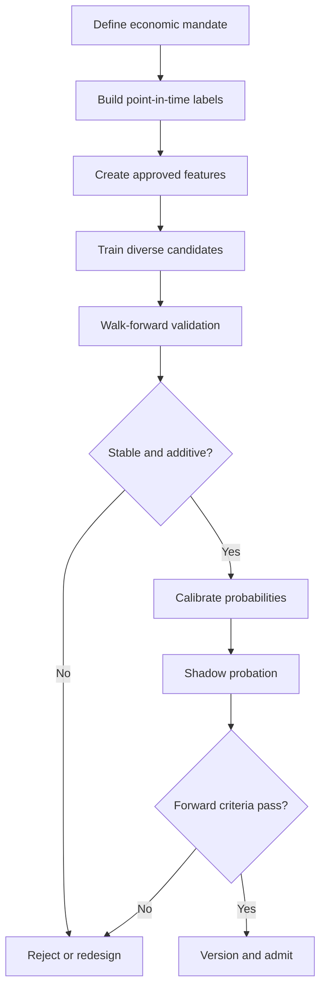

---

## 33. How TTC Works During a Live Decision

At each scheduled decision time:

1. **Ingest:** TTC receives market, reference, portfolio, and event data.
2. **Validate:** It rejects stale, incomplete, duplicated, or inconsistent inputs.
3. **Snapshot:** It freezes one point-in-time input package for the session.
4. **Calculate features:** Shared measurements are calculated once and reused.
5. **Classify regime:** The Ranger estimates market-state probabilities.
6. **Determine eligibility:** Members outside their approved regime or data domain are excluded.
7. **Generate ballots:** Eligible Members independently submit long, short, or abstain opinions.
8. **Aggregate:** The Council weights ballots and penalizes correlation and grove concentration.
9. **Calibrate:** Raw agreement is mapped to realistic historical probabilities.
10. **Calculate expectancy:** Reward, loss, trading costs, and uncertainty are combined.
11. **Assign conviction:** TTC assigns No Edge, Watch, Qualified, Strong, or Exceptional.
12. **Authorize risk:** The Guardian approves, reduces, or rejects exposure.
13. **Execute:** The Executor places orders only within the authorization envelope.
14. **Monitor:** Position, market state, model health, and order state are tracked.
15. **Record:** Every input, vote, rule, decision, and outcome is stored for replay.

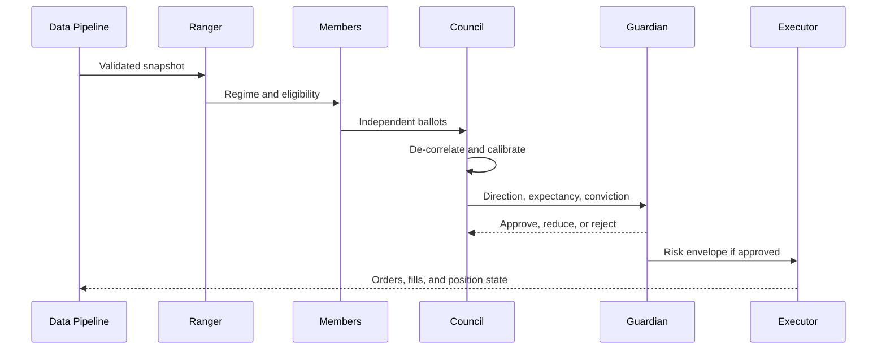

### 33.1 Example Council session

Assume TTC evaluates SPY for a Swing Council decision:

| Session item | Result |
|---|---:|
| Configured Members | 40 |
| Eligible Members | 34 |
| Long ballots | 24 |
| Short ballots | 5 |
| Abstain ballots | 5 |
| Raw directional long consensus | 82.8% |
| Effective independent Members | 17.6 |
| Correlation-adjusted consensus | 74.5% |
| Calibrated success probability | 62.0% |
| Estimated average favorable move | 1.7% |
| Estimated average adverse move | 1.0% |
| Estimated total costs | 0.08% |
| Conviction tier | Qualified |

The Guardian may approve only a half-sized position because Qualified conviction carries a 0.50× multiplier. The position is smaller even though raw consensus appears high because correlation and calibration reveal less certainty.

---

## 34. Built-In Model Rules and Their Purpose

TTC rules are divided into immutable safety principles, configurable strategy policies, and learned model behavior.

### 34.1 Immutable safety principles

These rules should not be optimized by machine learning:

| Rule | Purpose |
|---|---|
| No future information | Prevent look-ahead leakage and false results |
| Same mandate for all session voters | Ensure votes answer the same question |
| Abstention is always available | Prevent forced low-quality trades |
| Risk has veto authority | Prevent prediction confidence from overriding portfolio safety |
| No Member places orders | Separate forecasting from capital authority |
| Every decision is versioned | Make results reproducible and auditable |
| Stale or incomplete data causes abstention | Prevent corrupted-input trading |
| Every position addition is a new decision | Prevent uncontrolled averaging down |
| Every forecast expires | Prevent execution of obsolete signals |
| Production models cannot self-modify | Preserve release control and rollback |

### 34.2 Configurable strategy policies

These rules are selected through research and then frozen for each release:

- Required effective consensus.
- Minimum calibrated probability.
- Minimum net expectancy.
- Minimum number of eligible Members.
- Required number of supporting groves.
- Maximum influence from one grove.
- Maximum Member weight.
- Conviction-tier position multipliers.
- Entry trigger and signal expiration.
- Exit and time-stop policy.
- Instrument and session restrictions.
- Drawdown and concentration limits.

Configurable does not mean discretionary. Changes require a new strategy version and validation.

### 34.3 Learned behavior

Member and Ranger models learn statistical relationships from historical training data, such as:

- Which combinations of trend and volatility have historically favored continuation.
- When a price extension has historically reverted.
- Which breadth conditions confirm index movement.
- Which intermarket states weaken or strengthen a signal.
- When a Member should abstain because the predicted edge is insufficient.

Learned behavior cannot override fixed policy. A model may recommend a trade; it cannot waive a drawdown stop or increase its own weight.

### 34.4 Default operating rules for the initial Swing Council

The following are research starting points and must be validated before live use:

| Rule | Initial policy |
|---|---|
| Instrument universe | SPY and QQQ |
| Decision interval | Completed hourly bars with daily context |
| Holding horizon | 2–10 trading sessions |
| Initial roster | 40 Members |
| Minimum eligible Members | 24 |
| Minimum supporting groves | 3, with at least 4 participating |
| Maximum effective influence from one grove | 40% |
| Below 60% effective consensus | No Edge / abstain |
| 60–69% | Watch only |
| 70–79% | Qualified; up to 0.50× base risk |
| 80–89% | Strong; up to 1.00× base risk |
| 90% or higher | Exceptional; up to 1.25× base risk after enhanced review |
| Non-positive net expectancy | Always abstain |
| Uncertain or unsupported regime | Reduce size, raise thresholds, or abstain |
| Stale data or reconciliation failure | Freeze new orders |
| New Member | Shadow probation before influence |

These values are guardrails for the research program, not claims of optimality.

---

## 35. Programming Language and Technology Direction

TTC should use a hybrid language strategy because model research and production trading have different strengths.

### 35.1 Recommended language allocation

| Responsibility | Recommended language or format | Reason |
|---|---|---|
| Quantitative research | Python | Strong statistical, machine-learning, and time-series ecosystem |
| Model training and calibration | Python | Mature tree, calibration, validation, and explainability libraries |
| Backtest research notebooks | Python initially | Fast experimentation and visualization |
| Production orchestration | C# on .NET 8 | Strong typing, reliability, concurrency, observability, and alignment with the broader BeldInvest platform |
| Live model inference | C#/.NET using ONNX-compatible artifacts where feasible | Keeps production execution controlled and avoids a Python dependency in the trading path |
| Guardian and execution policies | C#/.NET | Deterministic behavior and strong state-management support |
| Data and audit persistence | SQL | Durable, queryable decision and execution history |
| Model interchange | ONNX where supported | Portable boundary between Python training and .NET inference |
| Strategy documentation | Markdown and Mermaid | Version-controlled rules and understandable decision diagrams |

### 35.2 Why not use only Python?

Python is the best default for quantitative research, but a production trading system also needs durable state, broker reconciliation, concurrency control, failure recovery, and auditable business rules. C#/.NET is well suited to those responsibilities and aligns with the intended BeldInvest architecture.

### 35.3 Why not use only C#?

A .NET-only design is possible, but it would restrict the research ecosystem and slow experimentation with statistical validation, probability calibration, interpretability, and financial time-series tooling. The production system should not give up Python’s research advantages merely to maintain language uniformity.

### 35.4 Recommended model boundary

The preferred boundary is:

1. Train and validate Member models in Python.
2. Freeze the approved preprocessing and model versions.
3. Export compatible models to ONNX or another controlled artifact format.
4. Load and evaluate them inside the .NET inference service.
5. Verify that Python and .NET produce equivalent results on a locked test dataset.
6. Keep the Guardian and Executor entirely outside the exported model.

Some research models may not export cleanly. Those models should remain outside the live path until they can be reproduced reliably or served behind a strictly controlled inference boundary. Operational convenience is not enough reason to accept irreproducible behavior.

### 35.5 Role of large language models

LLMs are optional and are not required for Council voting. They may support:

- Human-readable decision explanations.
- Research summaries.
- Model-performance investigations.
- Documentation and operational reporting.
- Later interpretation of carefully controlled unstructured news inputs.

LLMs should not:

- Calculate market indicators.
- Replace Member inference.
- Enforce risk limits.
- Reconcile positions.
- Directly approve or transmit live orders.
- Modify production rules autonomously.

This keeps normal Council voting inexpensive, fast, reproducible, and backtestable.

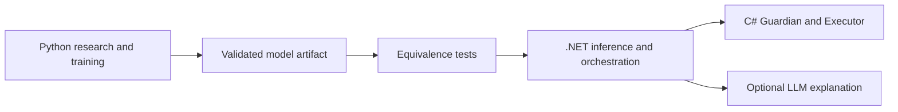

---

## 36. Model Purpose and Success Definition

The purpose of TTC is not simply to predict whether the next price bar will be green or red. Its purpose is to identify a limited set of opportunities for which:

- Multiple independent evidence families support the same direction.
- The current regime is compatible with those signals.
- The probability estimate is historically calibrated.
- The expected reward exceeds the expected loss and all trading costs.
- The portfolio has sufficient risk capacity.
- The decision can be executed and audited reliably.

TTC succeeds when it improves the quality and consistency of capital allocation. Success must be measured by:

- Positive net expectancy after realistic costs.
- Acceptable maximum drawdown.
- Stable behavior across market regimes.
- Reliable probability calibration.
- Effective rejection of marginal opportunities.
- Controlled portfolio concentration.
- Operational correctness.
- Transparent and reproducible decisions.

TTC does not succeed merely because it reaches a high win rate, generates many signals, or produces confident votes. A Council that frequently abstains but selects higher-quality opportunities may be substantially better than an active Council with a superficially impressive hit rate.

---

## 37. Final Strategy Statement

The Trading Council is not a collection of one hundred bots taking a popularity vote. It is a governed ensemble in which specialized Members provide distinct evidence, The Ranger determines environmental relevance, The Council measures effective agreement, The Conviction Engine verifies probability and economic edge, The Guardian controls portfolio risk, and The Executor implements only approved decisions.

The strategy’s defining rule is:

> **TTC commits capital only when diverse and eligible Members agree on the same time-bound opportunity, the agreement survives dependence and uncertainty penalties, expected value remains positive after costs, and the portfolio can accept the risk. Otherwise, the Council abstains.**

This structure preserves the original concept—the crowd can outperform the genius—while recognizing the hard truth that an uninformed or correlated crowd can also be confidently wrong.

---

## 38. Disclaimer

This document defines a research and trading-system framework. It does not guarantee results and is not individualized investment advice. Historical and simulated performance cannot establish future profitability. Any live deployment requires independent validation, appropriate professional review, controlled capital limits, and acceptance that loss of capital is possible.
